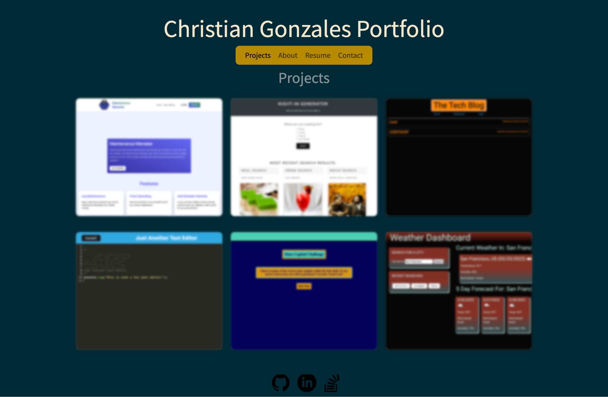

# Professional React Portfolio
## Description
This is a professional portfolio built using React.js. There are four pages that are conditionally rendered by clicking on the different links in the nav bar. The home page takes the user directly to the About page, displaying a picture and a simple paragraph about the portfolio owner. there is a resume page that provides a download link to their resume and has a short list of front-end proficiencies and back-end proficiencies. There is a contact page where the user can leave the portfolio owner a message. Finally there is the projects page that contains 6 projects built by the portfolio owner. Each project has a link to the deployed application and a link to the GitHub repo.
## Usage
The usage of the app is simple. 
1. Follow the link to the deployed app
2. Click the different links in the navbar to look around the webpage. 
3. On the projects page there are links to those deployed applications and their GitHub repo's. 
4. In the footer there are links to the portfolio owners GitHub account, LinkedIn, and Stack OverFlow account.
## Technologies
- [Vite](https://vitejs.dev/)
- [Netlify](https://www.netlify.com/)
### Resources
- [Deployed App](https://main--react-portfolio-09122023.netlify.app/)
- [Github Repo](https://github.com/cdgonzo23/professional-portfolio-react)
